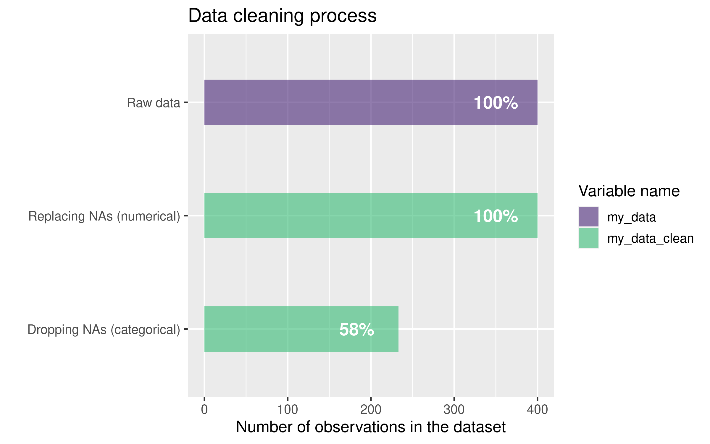
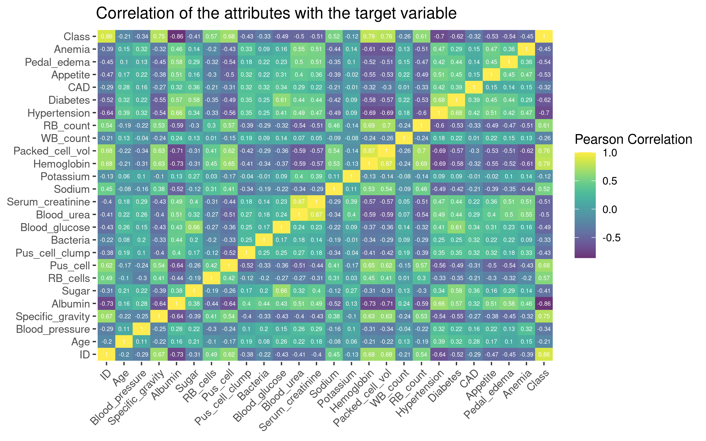
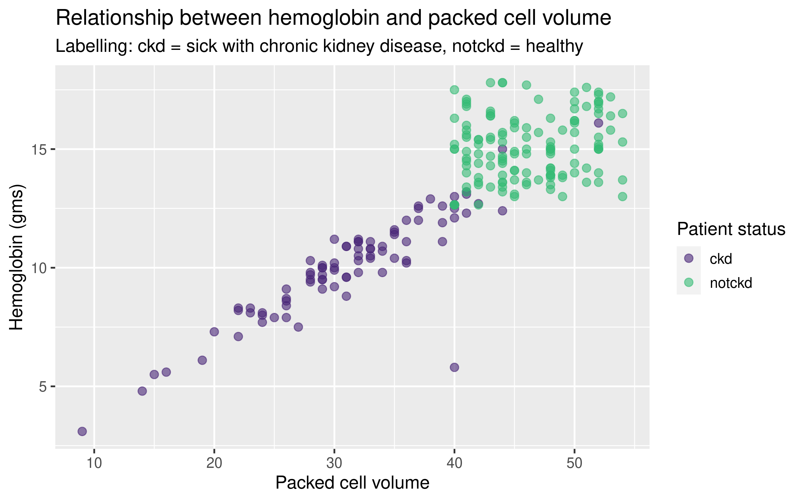
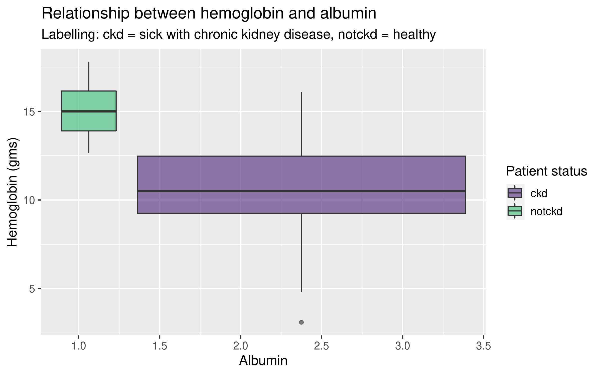
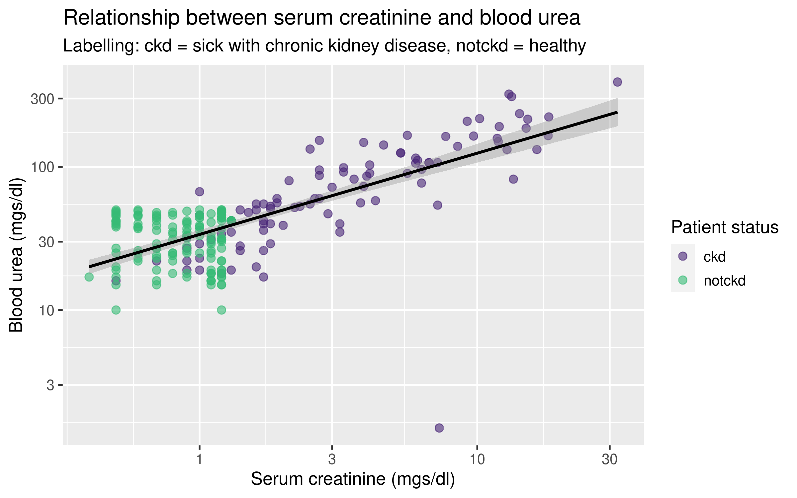

```{r setup, include=FALSE}
knitr::opts_chunk$set(echo = FALSE)
install.packages("png")
library(png)
```

## Introduction

-   **Chronic kidney disease** (**CKD**) is a type of kidney disease in which there is gradual loss of kidney function over a period of months to years

-   The main risk factors for developing kidney disease are diabetes, high blood pressure, heart disease, and a family history of kidney failure

## Materials and Methods

-   Cleaning and augmenting
-   Data exploration
-   Data analysis
-   Modelling

## Materials and Methods \| The Dataset

-   Dataset was obtained from UCI Machine Learning Depository
-   **400 observations of 25 attributes**:
    -   [numerical (15):]{.underline} age, blood pressure, specific gravity, albumin, sugar, blood glucose random, blood urea, serum creatinine, sodium, potassium, hemoglobin, packed cell volume, white blood cell count, red blood cell count

    -   [categorical (10):]{.underline} red blood cells, pus cell, pus cell clumps, bacteria, hypertension, diabetes mellitus, coronary artery disease, appetite, pedal edema, anemia, class

## Data loading, cleaning and augmentation

-   [**Loading**]{.underline}**:** Artificially splitting the dataset to **2 groups:** Healthy patients and patients with CKD

-   [**Cleaning:**]{.underline}

::: centered
{width="600"}
:::

-   [**Augmenting:**]{.underline} Creating new variables *Age_group, Disease_no, Disease_type*

## Data exploration

::: centered
{width="800"}
:::

------------------------------------------------------------------------


::: centered
{width="850"}
:::

<<<<<<< HEAD
------------------------------------------------------------------------

::: centered
{width="850"}
:::

------------------------------------------------------------------------

::: centered
{width="850"}
:::


## Data analysis \| PCA and K-nearest neighbours

## Modelling \| Linear regression and Finding the most optimal model

## Results

```{r cars, echo = TRUE}
summary(cars)
```

## Discussion

```{r pressure}
plot(pressure)
```
