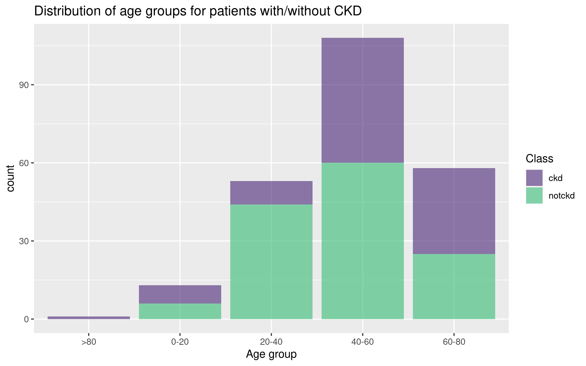
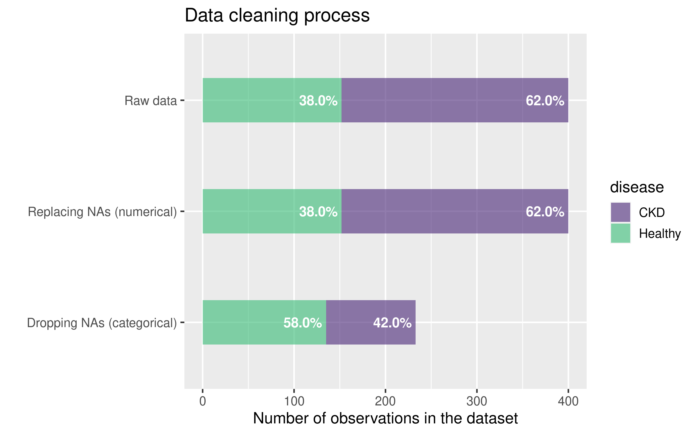
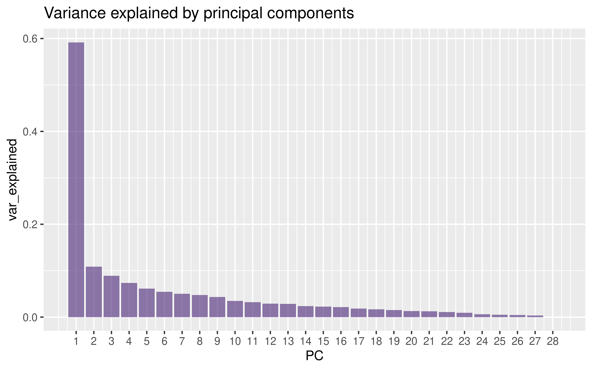
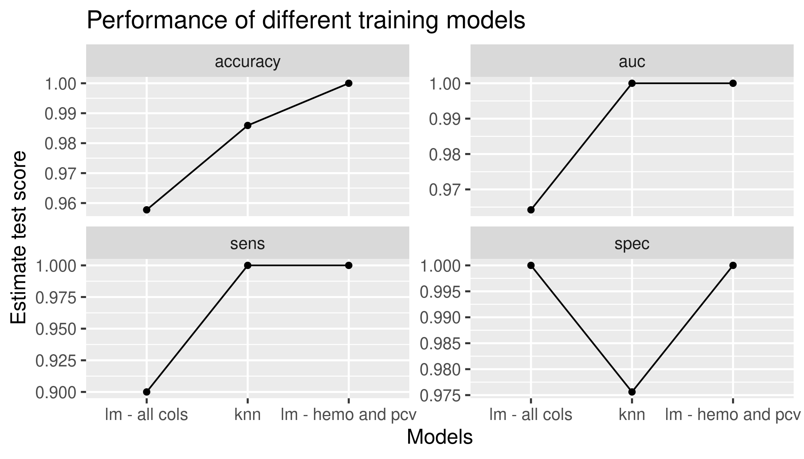

```{r setup, include=FALSE}
knitr::opts_chunk$set(echo = FALSE)
install.packages("png")
library(png)
```

## Introduction

-   **Chronic kidney disease** (**CKD**) is a type of kidney disease in which there is gradual loss of kidney function over a period of months to years

-   The main risk factors for developing kidney disease are diabetes, high blood pressure, heart disease, and a family history of kidney failure

-   The two key markers for CKD are urine albumin and eGFR (based on measuring the stable serum creatinine levels)

## Materials and Methods

1.  Cleaning and augmenting
2.  Data exploration
3.  Data analysis - *PCA*
4.  Modelling - *Linear regression and K-nearest neighbors*

## Materials and Methods \| **The Dataset**

-   The data-set was obtained from **UCI Machine Learning Depository**
-   **400 observations of 25 attributes**:
    -   [numerical (15):]{.underline} albumin, blood urea, <br/>serum creatinine, hemoglobin, <br/> packed cell volume, and others

    -   [categorical (10):]{.underline} class, anemia, <br/> diabetes melitus and others.

<div style= "float:right;position: relative; top: -170px;">

{width="521" height="317"}

## Data loading, cleaning and augmentation

1.  [**Loading**]{.underline}**:** Artificially splitting the dataset in **2 groups:** Healthy patients and patients with CKD and then joining
2.  [**Cleaning:**]{.underline}

::: centered
{width="600"}
:::

------------------------------------------------------------------------

{width="700"}

**3. [Augmenting:]{.underline}** Creating new variables *Age_group, Disease_no, Disease_type*

## Results and Discussion \| **Data exploration**

::: centered
{width="780"}
:::

## Data Visualisation \| **Hemoglobin and Packed Cell Volume relationship**

-   Hemoglobin analysis results in clear separation between classes: sick and healthy patients

-   Low hemoglobin (and low PCV) are related to anemia, a common CKD complication

::: centered
{width="600"}
:::

## Data Visualisation \| **Hemoglobin and Serum Albumin relationship**

-   Albumin = number of positive tests for albumin [in the urine]{.underline} (discrete)

-   Excess albumin in the urine ([low serum albumin]{.underline}) is an indicator of kidney failure

::: centered
{width="600"}
:::

## Data Visualization \| **Serum Creatinine and Blood Urea relationship**

-   Most common markers for assessing renal function: [the glomerular filtration rate]{.underline} (rapid decline of GFR associated with CKD)

::: centered
{width="600"}
:::

## Principal component analysis

::: centered
{width="800"}
:::

## Principal component analysis

::: centered
{width="800"}
:::

## Modelling \| Linear regression - all redictors

{width="500"} {width="400"}

## Modelling \| Linear regression - Hemoglobin and PCV

{width="500"} {width="400"}

## Modelling \| K-Nearest Neighbors

{width="500"}

{width="400"}

## Modelling \| Model metrics summary

::: centered
{width="700"}
:::

## Modelling \| ROC - All models

::: centered
{width="700"}
:::

## Conclusion

-   Linear regression with hemoglobin and PCV - highest specificity and sensitivity

-   Prediction of CKD based only on 2 attributes

-   Application in diagnostics

-   Future: use of serum creatinine and blood urea in modelling
